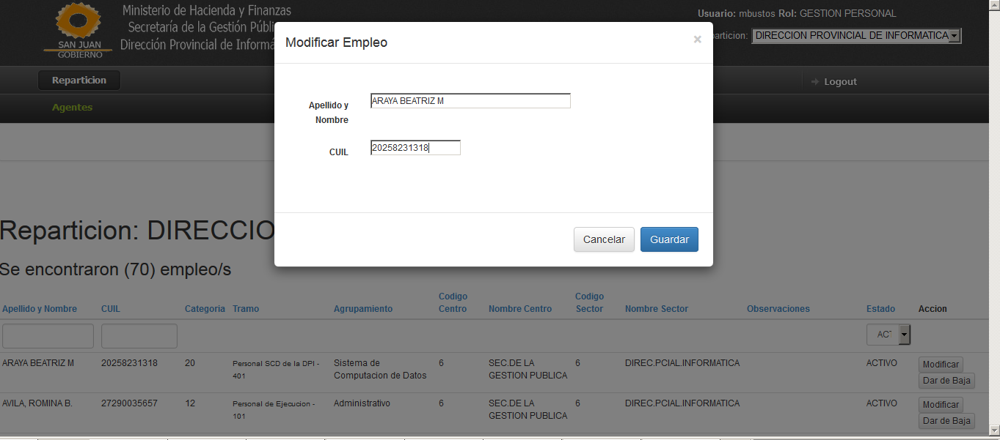

# Human Resources Management

This project is intended to manage the human resources of an organization.

## Modules:
### Credits Management

This module is intended to manage the credits assigned to departments of an organization. 
Each department has a balance of credits that are used to add or promote employees.





## Technologies
### Frontend

- AngularJS 1.2.16 
- Bootstrap 3.1.1
- Supported browsers: Internet Explorer 9+, Firefox, Chrome

### Backend
- Java 1.6+
- Maven 3 
- Spring MVC 3.2.5.RELEASE 
- Hibernate 3.6.8.Final 
- Database Oracle 10g 
- HSQLDB for integration testing

## Profiles

In order to have different environment this project uses spring profiles. Using properties by profile: 

 - Development (dev)
 - Production (prod)
 - Testing (test)

## Testing


Integration tests are ran using HSQLDB, an in-memory dababase HSQLDB

 - Database schema
test-data/schema.sql

 - Test Database
test-data/data.sql

## Development

For development purposes we can run EmbeddedTomcatLauncher.java with this JVM property

```
-Dspring.profiles.active=dev
```
This launches the application using the embedded Tomcat, no need to have an external Tomcat instance installed.


## Production

Set the Java System Property when starting the servlet container for the production profile.


```
-Dspring.profiles.active=prod
```

## Set environment Java properties in Production
 - On Windows 7 64x
For the Tomcat service, startup settings are stored in the registry under 'Options' key at:
HKEY_LOCAL_MACHINE\SOFTWARE\Apache Software Foundation\Procrun 2.0\Tomcat<X>\Parameters\Java
(substitute appropriate Tomcat version where needed).
On 64-bit Windows, the registry key is:
HKEY_LOCAL_MACHINE\SOFTWARE\Wow6432Node\Apache Software Foundation\Procrun 2.0\Tomcat<X>\Parameters\Java
even if Tomcat is running under a 64-bit JVM.


## ChangeLog

2014 - July
 
 - Refactored employment editor as an Angular directive, in order to be a reusable web component
 - Organized AngularJS code into scalable folders. Grouped files by feature.
 - Added AngularJS validator for verifying the employee CUIL in the form
 - Added AngularJS Growl notifications. Feedback about operations results.
 - Replaced underscore.js by lodash.js
 - Backend: Added Spring MVC GlobalControllerExceptionHandler
 - Backend: Ordering by employee name, case insensitive.

2014 - June

 - Added REST API to retrieve employments of a department
 - Using Restangular to call server REST API 
 - JSON support: migrated Jackson from Codehaus to Fasterxml
 - Started migration to AngularJS. Showing the grid of employments
 - Introduced Boostrap CSS Framework
 
2014 - May

 - Added testing infrastructure

2014 - April

 - Added profiles for development, test and production
 - Added reporting functionality
 - Added i18n support


## Pending tasks

- Add Unit Tests and Integration Tests
- Make it SinglePage Application (Angularjs) 

- Implement module "Leaves Management" This module is intended to manage the leaves of the employees.


## Credits

- http://stackoverflow.com/questions/8609998/how-to-pass-a-system-property-to-a-web-application-hosted-in-tomcat-7-running-as
- Spring by Example - David Winterfeldt

### AngularJS Plugins

- Alerts and Messages - 
https://github.com/mateu-aguilo-bosch/message-center

- Alerts Growl - https://github.com/JanStevens/angular-growl-2